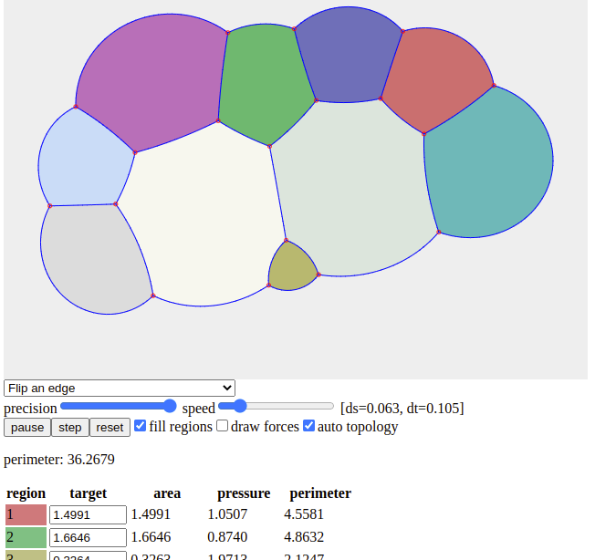

# cluster evolver

Try it online at https://paolini.github.io/jsbubble/

Draw your bubbles and see them evolve to a (locally) minimal bubble cluster. 

You can change the target area of each bubble, split them, flip, remove, or collapse edges by selecting
the corresponding tool and clicking on the edge.
You can split a vertex if it has at least four edges.
You can color (fill) the bubble interiors to identify them.
You can show the instantaneous forces (draw forces)
and activate automatic topological changes (auto topology) which means that shrinking edges are flipped.

You can try to change the precision (shorter segments) and the velocity (faster evolution). 
This might lead to instabilities and blow ups.

## copyright

 Copyright 2021, 2022 Emanuele Paolini (emanuele.paolini@unipi.it)

 see [COPYING](COPYING)
 
 This program is free software: you can redistribute it and/or modify it under the terms of the GNU General Public License as published by the Free Software Foundation, either version 3 of the License, or (at your option) any later version.
 
 This program is distributed in the hope that it will be useful, but WITHOUT ANY WARRANTY; without even the implied warranty of MERCHANTABILITY or FITNESS FOR A PARTICULAR PURPOSE. See the GNU General Public License for more details.
 
 You should have received a copy of the GNU General Public License along with this program. If not, see <https://www.gnu.org/licenses/>.
 